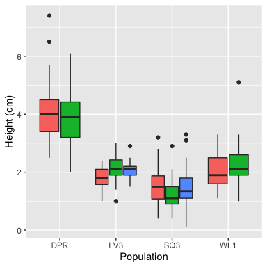
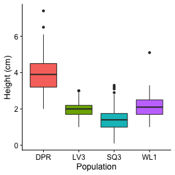
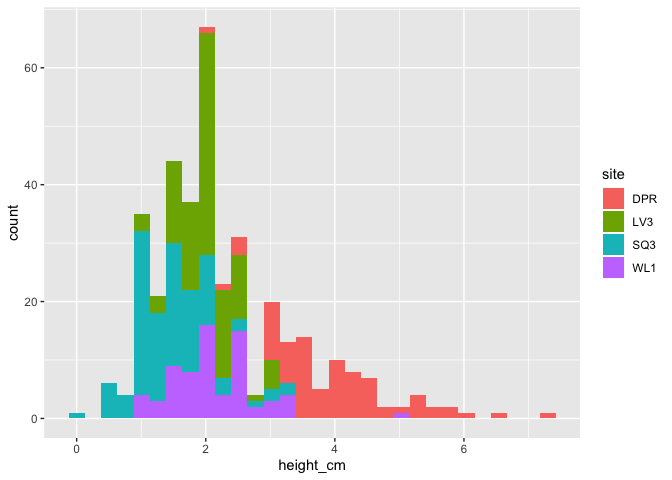

## This is a markdown document

If you want this to render on github, you need to add the keep_md option as I have above. Some things still won't look as nice on the github site as they do in the html you create locally (e.g., math, kable tables).

You can have a nice, linked table of contents with the toc options.

There are some viewing options worth fiddling with via the little gear menu. You can have code output in line or in the console. You can have your knit document in a viewer pane or in a new window. 

### You can run code right in here

If echo = TRUE, the code is displayed. For a more polished doc, set echo to FALSE.

If your code is slow to run, set cache = TRUE so R doesn't have to re-run chunks unless you change them. 


```r
library(tidyverse)
library(knitr)

# Setting my root directory so that I can call to other scripts (setwd() doesn't work here and isn't advisable anyways)
knitr::opts_knit$set(root.dir = normalizePath('../'))
```

### You can add plots too

#### That you create here...


```r
dat = read_csv("data/clean_vern.csv")

ggplot(dat) +
  geom_boxplot(aes(x = site, y = height_cm, fill = block)) +
  guides(fill = FALSE) +
  labs(x = "Population", y = "Height (cm)")
```

<!-- -->

#### Or with a relative path...

If you've already got a plot somewhere (or a photo, etc.), you can pull it in (can't do this with pdfs).



Note that I have set the R code chunks to reference the main project directory, but when calling to an image file outside the R code chunks the path is relative to the folder that this .Rmd file resides in.


### You can also make tables

Keep it simple though.

#### Either with code...

You can wrap a line of table-making code in kable().


```r
kable(dat %>% group_by(site, block) %>% summarize(n = n()))
```


site   block     n
-----  ------  ---
DPR    B1       40
DPR    B2       40
LV3    B1       40
LV3    B2       40
LV3    B3       25
SQ3    B1       40
SQ3    B2       31
SQ3    B3       40
WL1    B1       35
WL1    B2       34

Or put it in an object and wrap that in kable(). 


```r
tab1 = dat %>% group_by(site, block) %>% summarize(n = n())

kable(tab1)
```


site   block     n
-----  ------  ---
DPR    B1       40
DPR    B2       40
LV3    B1       40
LV3    B2       40
LV3    B3       25
SQ3    B1       40
SQ3    B2       31
SQ3    B3       40
WL1    B1       35
WL1    B2       34


#### Or by typing them in...

Variable | Definition
---------|----------------------
stem_diam_mm | Stem diameter in millimeters
longest_leaf_mm | Length of the longest leaf, not including petiole, in millimeters
height_cm | Height to tallest part of plant, in centimeters
number_true_leaves | The number of true leaves on a plant


### You can source other scripts

You can also source things from another script, then call to them. It takes a bit of fussing to get working directories correct (see first code chunk). Here I source a script that generates a little table and a plot, then call in these objects.


```r
kable(pops)
```


Population    Latitude   Longitude   Elevation (m)     N
-----------  ---------  ----------  --------------  ----
DPR             39.228    -120.815            1020    80
WL1             38.786    -120.214            1680    69
SQ3             36.721    -118.849            2350   111
LV3             40.466    -121.523            2440   105

```r
height_hist
```

<!-- -->


### You can also call to R in line

For example, the populations in this dataset are LV3, SQ3, DPR, WL1.


### Math is not too bad

$\pi r^2$


### Interactive graphs?

To try this out, uncomment the lines below and the runtime: shiny line in the header.


