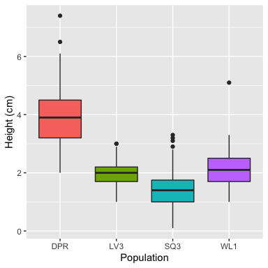

## This is a markdown document

If you want this to render on github, you need to add the keep_md option as I have above. Some things still won't look as nice on the github site as they do in the html you create locally (e.g., math, kable tables).

You can have a nice, linked table of contents with the toc options.

### You can run code right in here

If echo = TRUE, the code is displayed. For a more polished doc, set echo to FALSE.


```r
library(tidyverse)
library(knitr)
dat = read_csv("../data/clean_vern.csv")
```

### You can build plots too

With code:


```r
ggplot(dat) +
  geom_boxplot(aes(x = site, y = height_cm, fill = site)) +
  guides(fill = FALSE) +
  labs(x = "Population", y = "Height (cm)")
```

<!-- -->

Or with a relative path (can't do this with pdfs):


### You can also make simple tables

##### Either with code:


```r
kable(dat %>% group_by(site, block) %>% summarize(n = n()))
```


site   block     n
-----  ------  ---
DPR    B1       40
DPR    B2       40
LV3    B1       40
LV3    B2       40
LV3    B3       25
SQ3    B1       40
SQ3    B2       31
SQ3    B3       40
WL1    B1       35
WL1    B2       34

##### Or by typing them in:

Variable | Definition
---------|----------------------
stem_diam_mm | Stem diameter in millimeters
longest_leaf_mm | Length of the longest leaf, not including petiole, in millimeters
height_cm | Height to tallest part of plant, in centimeters
number_true_leaves | The number of true leaves on a plant


### You can also call to R in line

For example, the populations in this dataset are LV3, SQ3, DPR, WL1.


### Math is not too bad

$\pi r^2$


### Interactive graphs?


